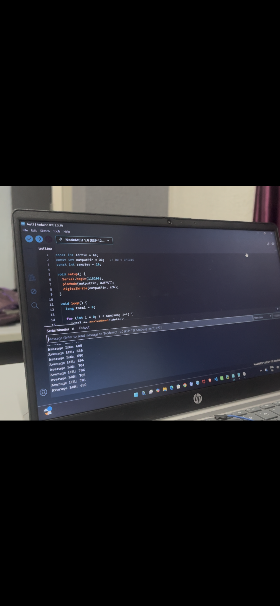
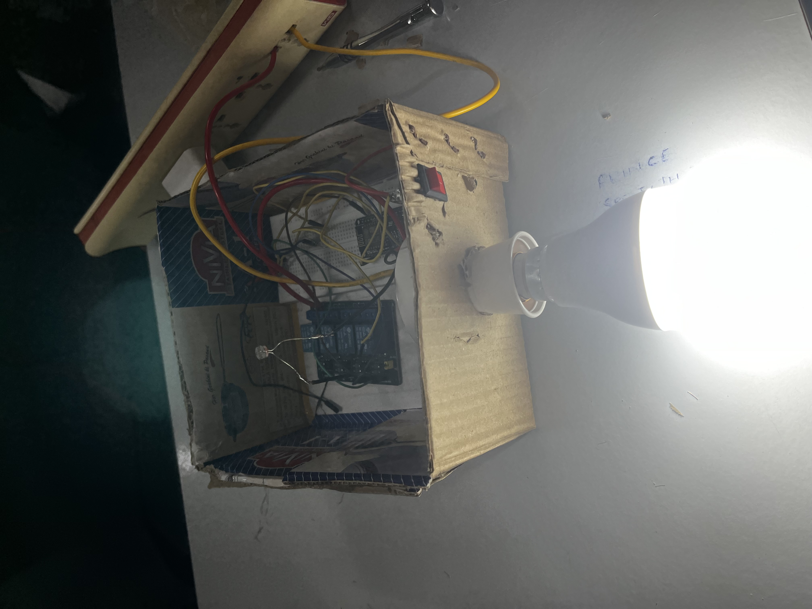
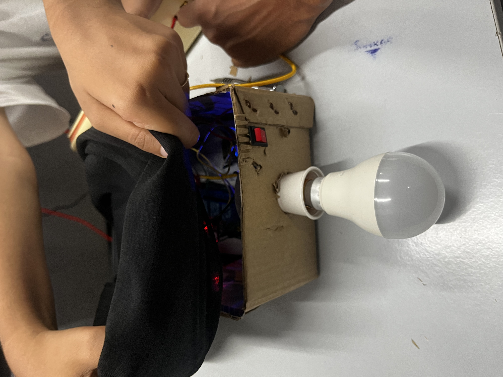
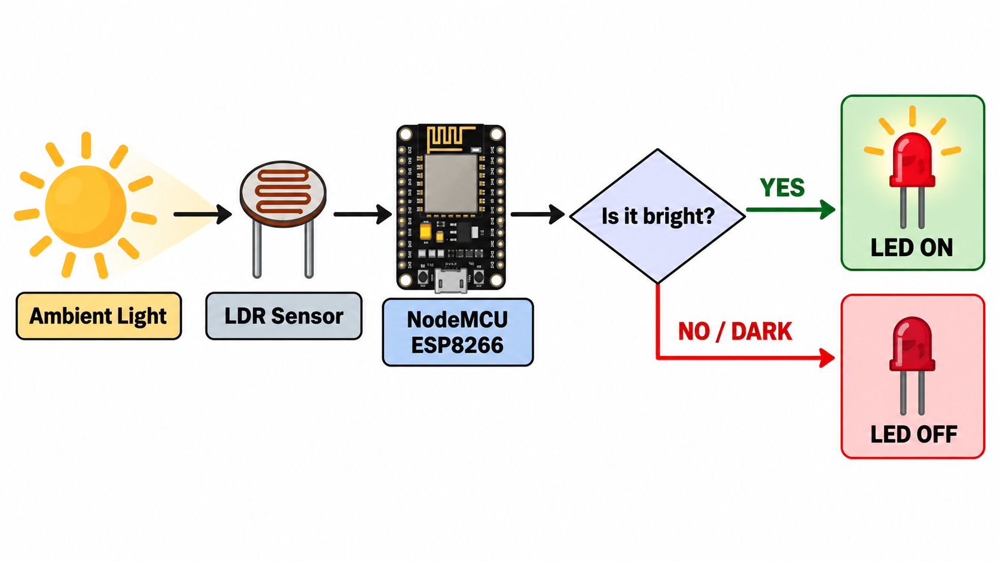
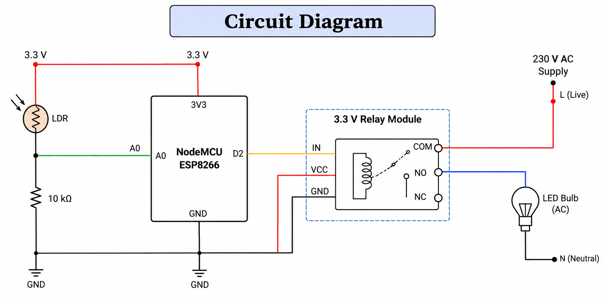
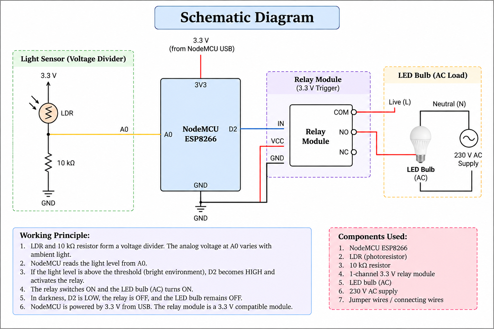
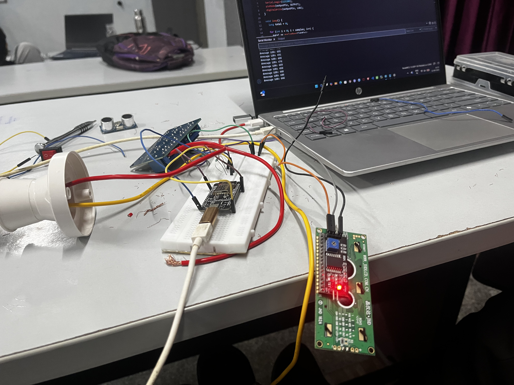
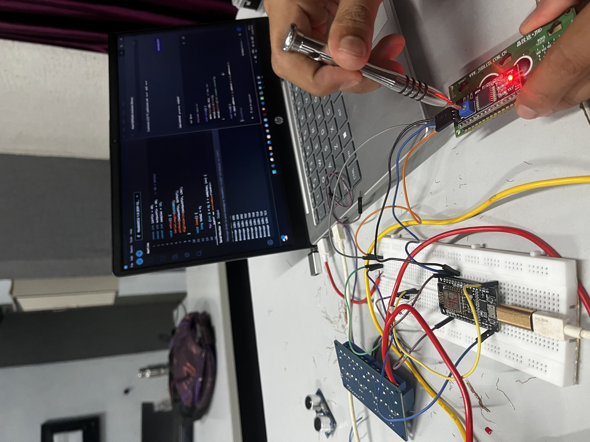
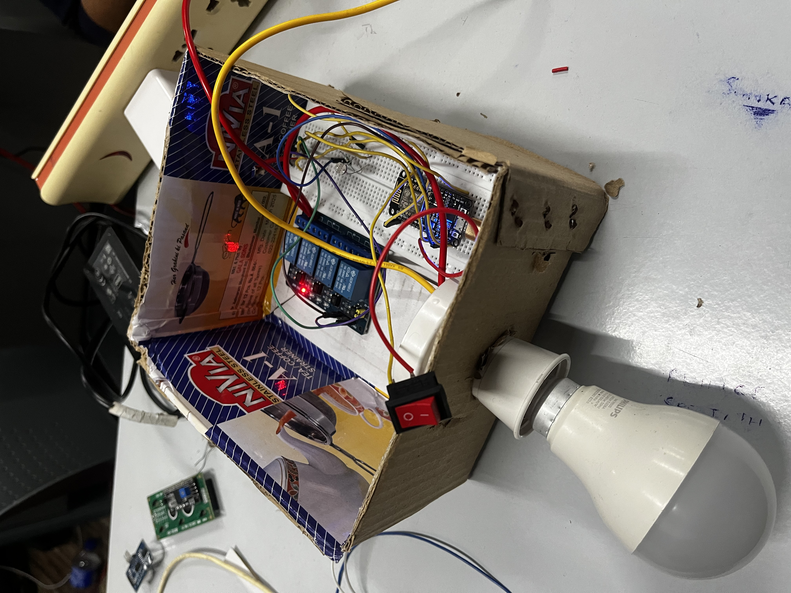

# [Anti-Dark Light] 🎯


## Basic Details
### Team Name: [Shittumani]


### Team Members
- Team Lead: [Sreejith T] - [JCET]
- Member 2: [Aashika P] - [JCET]
- Member 3: [Name] - [College]

### Project Description
Our project is a revolutionary light that refuses to help when it is dark.  
Unlike normal automatic lights, this one turns ON only when there is already enough light around it—and switches OFF the moment darkness arrives.

### The Problem (that doesn't exist)
Normal lights turn on during darkness, making it far too easy for people to see where they are going.  
We believe darkness deserves privacy, peace, and a chance to surprise people.

### The Solution (that nobody asked for)
Using an LDR light sensor and a microcontroller, our light constantly checks the surrounding brightness.  
When the environment is bright, the LED proudly turns ON. When it gets dark, the LED panics and turns OFF.

## Technical Details
### Technologies/Components Used
For Software:
Language: C++ using Arduino IDE
- Framework: Arduino core for ESP8266
- Libraries:
  - Arduino built-in functions
  - Tools:
  - Arduino IDE
  - USB cable
  - Serial Monitor

For Hardware:
- NodeMCU ESP8266
- LDR / photoresistor
- 10kΩ resistor
- LED Bulb
- Breadboard
- Jumper wires
- USB cable

### Implementation
For Software:
# Installation
1. Install Arduino IDE.
2. Add the ESP8266 board package in Arduino IDE.
3. Connect the NodeMCU to the computer with a USB cable.
4. Select `NodeMCU 1.0 (ESP-12E Module)` as the board.
5. Select the correct COM port.

# Run
Connect the LDR voltage-divider output to `A0` and the LED to `D2`.

```cpp
const int ldrPin = A0;
const int ledPin = D2;

int lightValue = 0;
int threshold = 500; // Adjust according to room brightness

void setup() {
  pinMode(ledPin, OUTPUT);
  Serial.begin(9600);
}

void loop() {
  lightValue = analogRead(ldrPin);

  Serial.print("Light value: ");
  Serial.println(lightValue);

  if (lightValue > threshold) {
    digitalWrite(ledPin, HIGH);
  } else {
    digitalWrite(ledPin, LOW);
  }

  delay(500);
}

### Project Documentation
For Software:

# Screenshots (Add at least 3)

Arduino IDE showing the code that makes the LED bulb work only in bright light


The LED turns ON in a bright environment, proving it is completely unnecessary


The LED turns OFF in darkness, exactly when it is needed most

# Diagrams

The system tests the surrounding light level using an LDR sensor. The NodeMCU reads the sensor value and controls the LED bulb; when the environment is bright, the LED bulb turns ON and when it is dark, the LED bulb turns OFF.

For Hardware:

# Schematic & Circuit

The circuit connects the LDR sensor to the NodeMCU’s analog input through a voltage-divider arrangement. The NodeMCU reads the surrounding light level and controls the LED connected to a digital output pin. The LED turns ON when bright light is detected and turns OFF in darkness.


The schematic shows the electrical connections between the NodeMCU, LDR, 10kΩ resistor, LED, and 220Ω current-limiting resistor. The LDR and 10kΩ resistor create a variable voltage signal for the NodeMCU, while the LED output is controlled through a digital pin.

# Build Photos

NodeMCU, LDR, LED, resistors, breadboard, jumper wires, and USB cable


Connecting the LDR circuit to A0 and connecting the LED to D2


Final build of our project, successfully refusing to illuminate darkness

### Project Demo
# Video
[Add your demo video link here](IMG_4194.mov)
The video demonstrates the LED turning ON in bright light and switching OFF when the surroundings become dark

# Additional Demos
[Add any extra demo materials/links]
(1789171864351299.mov)

## Team Contributions
- [Sreejith T]: [NodeMCU programming and LDR calibration]
- [Aashika P]: [Circuit design and hardware wiring]


---
Made with ❤️ at TinkerHub Useless Projects 


